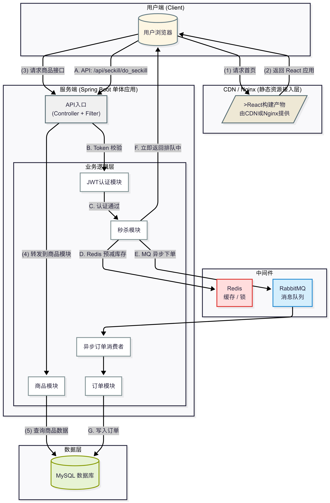

# 高并发秒杀系统 React + SpringBoot WebService(seckill-project)

本项目是一个为期两个月的实习项目，旨在开发一个完整的高并发秒杀系统。系统采用前后端分离架构，技术栈为 React + Spring Boot。本项目致力于通过前端优化、后端服务化以及引入多种高并发解决方案，来提升系统的性能、稳定性和安全性，确保在高流量的秒杀场景下能够稳定运行。

## 1. 主要功能与成果 (Key Features & Achievements)

* **前端优化**: 使用 React 重构前端页面，提升用户体验，采用页面静态化技术减少服务器压力
* **登录安全**: 优化 Login 模块，集成 Authentication & Authorization（如JWT），保障用户身份验证与权限控制 
* **高并发优化**: 研究并应用如缓存、异步处理、分布式锁等高并发方案，提高系统吞吐量
* **数据持久层**: 使用 MyBatis/Hibernate 管理数据库操作，优化SQL查询效率
* **防超售机制**: 设计并实现库存预扣减、乐观锁等策略，有效防止商品超卖问题

## 2. 技术栈 (Technology Stack)

2.1 **前端 (Frontend)**
* **React**: 用于构建用户界面的主流 JavaScript 库
* **Axios**: 用于处理前后端之间的 HTTP 网络请求
* **NPM**: Node.js 包管理器
* **页面静态化**: 降低服务器渲染压力，提升CDN命中率

2.2 **后端 (Backend)**
* **Spring Boot**: 主流的 Java 应用开发框架，用于快速构建后端服务
* **Maven**: Java 项目构建与依赖管理工具
* **MyBatis/Hibernate**: ORM 框架，用于简化数据库操作
* **JWT**: 用于实现用户认证与授权的 JSON Web Token 方案

2.3 **高并发中间件 (Middleware for High Concurrency)**
* **Redis**: 高性能内存数据库，用于实现缓存和分布式锁
* **RabbitMQ/Kafka**: 消息队列，用于实现服务解耦、流量削峰和异步下单

2.4 **数据库 (Database)**
* **MySQL**: 关系型数据库，用于核心数据的持久化存储

## 3. 系统架构 (System Architecture)



## 4. 快速启动 (Quick Start)

请确保你的本地环境已安装以下工具：
* JDK 17+
* Node.js v20+ (通过 nvm 安装)
* Maven 3.8+
* MySQL 8.0+
* Redis

### 4.1 克隆项目

```bash
git clone git@github.com:nancyxieyy/seckill-project.git
cd seckill-project
```

### 4.2 启动后段服务

#### 4.2.1 数据库准备

* 启动你本地的 MySQL 服务
* 连接到 MySQL (`/usr/local/mysql/bin/mysql -u root -p`)
* 创建一个名为 `seckill` 的数据库: `CREATE DATABASE seckill CHARACTER SET utf8mb4`;

#### 4.2.2 修改配置:

* 打开 `backend/src/main/resources/application.properties` 文件

* 修改 `spring.datasource.password` 为你自己的 MySQL 密码

#### 4.2.3 运行后端:

* 打开一个终端，进入 backend 目录

* 运行命令: `mvn spring-boot:run`

* 服务将启动在: `http://localhost:8080`

### 4.3 启动前端服务

#### 4.3.1 安装依赖:

* 打开另一个新的终端，进入 frontend 目录

* 运行命令: `npm install`

#### 4.3.2 运行前端:

* 在上一个终端继续运行: `npm start`

* 应用将启动在: `http://localhost:3000` (或 3001)

### 4.4 访问应用

* 在浏览器中打开 `http://localhost:3000` (或 3001) 即可看到前端页面

## 5. 项目结构

```bash
seckill-project/
├── backend/      # Spring Boot 后端应用源码
├── frontend/     # React 前端应用源码
├── docs/         # 项目文档与图片（例如架构图）
└── README.md     # 你正在看的这个文件
```